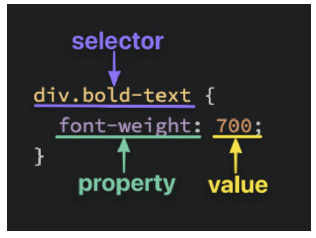
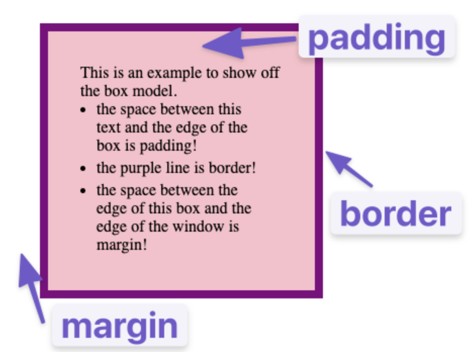
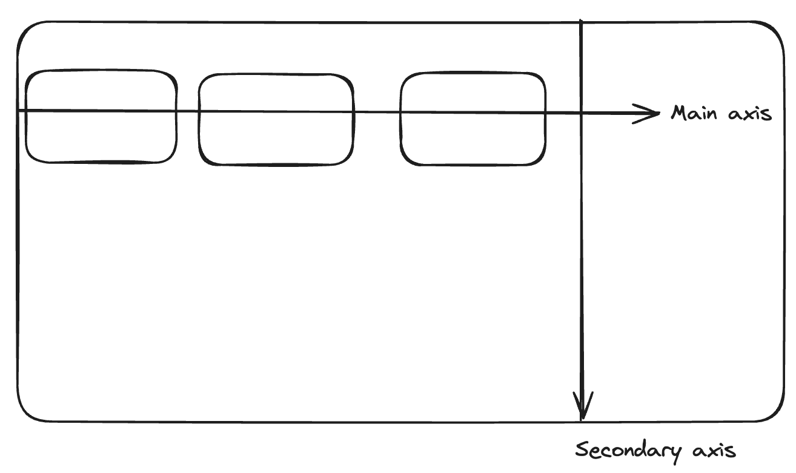
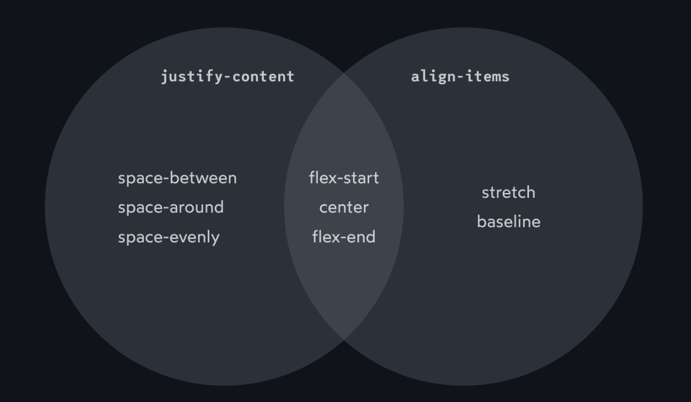

# HTML Boilerplate

[toc]

* Every webpage has some tags that will always be there

## Boilerplate

### DOCTYPE

* Specifies the version of html to be used
* Current version is version 5
* No real need to change from this

```html
<!DOCTYPE html>
```

### html

* Tag is the root element of the document
* Should be the encompassing tag of all other tags except DOCTYPE
* Should define a `lang` on it
    * Useful for accessibility

```html
<html lang="en"></html>
```

### head

* Contains metadata
* Things like title and charset

#### meta

* The meta tag is directly metadata of the webpage
* There is one that is absolutely necessary

```html
<meta charset="utf-8">
```

* This allows you to use all of the utf-8 character set. Otherwise some characters may be missing

#### title

* Does exactly what you think

### Body

* Just contains all the actual contain of the page.

### All together

```html
<!DOCTYPE html>
<html lang="en">
	<head>
		<meta charset="utf-8">
		<title>My title</title>
	</head>
	<body>
		Le content
	</body>
</html>
```

# Working with text
## Paragraphs

* Just use the p tag bruv

## Headings

* Can go from h1 to h6
* H1 should be the overall heading of the page

## Strong

* Used to bold text
* Affects tools likes screen readers
    * The tone of voice will change
* It is a span like element that is most likely to be used in another bunch of text

## Em

* Italicizes for emphasis
* Also for screen readers
* Probably used in other text elements like strong

## HTML comments

* Can start comment with <!— and end with —>

# Links and images

## Anchor elements
* Used to create a link in html
* Wrap in an `<a>` tag
* If we dont specify a href, the anchor wont be a link at all though
* `<a href="https://google.com">Google</a>`
* Can link to any kind of resource on the internet
  * Not just other webpages
  * EG
    * Video
    * PDF
    * Images

### HTML Attributes
* Gives additional information to an HTML element
* Usually made of a key and value pair
* Not all attributes need a value
  * Presumably booleans, right?

### Opening links in a new tab
* The default behavior of a link opens in the same tab
* Can use the `target` attribute to specify where its meant to open
  * By default, the value is `_self`
  * Set to `_blank` to open in a new tab
* Additionally need to add a `rel` attribute with values `noopener noreferrer`
  * For security
    * A lot of browsers automatically include this but its a good idea
  * `noopener` = prevent opened link from getting access to webpage
  * `noreferrer` = prevent opened link from knowing which webpage has the link
```html
<a href="https://google.com" target="_blank" rel="noopener noreferrer">Google!</a>\
```

## Absolute and relative links
### Absolute
* For linking to other websites
* Must contain the protocol and domain of the destination in full
  * `protocol://domain/path`

### Relative
* For linking to other pages within our own website
* Doesn't need the domain as it assumes the same domain
* Only includes the file path to the other page, relative to the current page

#### Parent directories
* What if directory is up some stories?
* Use `../` to get there!

## Images
* Use an `img` element
* This is self-closing
  * Does not need a closing tag at all!
* Instead embed the image with the `src` attribute
  * Much like the href attribute
  * Can be absolute or relative
```html

```

### Alt attribute
* Every image must also have an alt text
  * Used to describe image
  * Incase image can't be loaded
  * Describes to visually impaired users as well
  * **Accessibility**

### Image size attribute
* Not required, but helps with layout of page
* Makes the page reserve that space
* Good habit to always specify the sizes
  * Even if the image is the correct size or using CSS to modify

## Image formats
* Four main image formats on the web
  1. JPG
  2. GIF
  3. PNG
  4. SVG

### JPG
* Designed for handling large colour palettes without huge file size
* Good for photos with lots of gradients
* Doesn't allow for transparent pixels :(

### GIF
* For simple animations
* Limited in color palette
* DONT USE FOR PHOTOS
* Can't have semi-opaque pixels
  * Either fully transparent or fully opaque
* Difficult to get lots of detail :(

### PNG
* Good for anything thats not a photo or animated
* Can do opacity and doesn't have colour palette limitations
  * Generally larger than a JPG though
* Perfect for icons, technical diagrams, logos, etc

### SVG
* Vector-based graphics
  * Meaning, can scale to any dimension without loss of quality
* Excellent tool for responsive design
* Good for all the same use cases as a PNG, but just better!
* Used exactly like the rest despite being elite af
* ONE ISSUE
  * If it contains a lot of text, it may be fucked?

# Commit Messages


## Good vs bad commits
* Shit like `fix a bug` is a bad commit
  * Too vague
* A good commit explains the why behind the change.
  * Describes what problem the change solved and how it solved them.
* Effective commits have a subject and body

### Subject
* A brief summary of the change you made to the project
```
This is the change I made to the codebase.
```

### Body
* A concise but clear description of what you did
```
Describe the problem your commit solves and how.
```

## When to commit
* Commits are kind of like snapshots of a moment in time
* Considered best practice to commit every time you have a meaningful change in code
  * IE commit when you get something working as intended, fix a typo of fix a bug

## Seven rules of a good commit message
1. Separate subject from body with a blank line
2. Limit the subject line to 50 characters
3. Capitalize the subject line
4. Don't end the subject line with a period
5. Use imperative mood in subject line
   * If the commit answers "If applied, this commit will <commit>", then you're good.
6. Wrap at 72 chars
7. Use the body to explain what and why, not how

# Intro to CSS
* CSS make shit look goooooood

## Basic syntax
* CSS is made of various rules
  * The rules are made up of selector
  * A semicolon separated list of declarations
  * Each declaration has a key and value pair


### Selectors
* Refer to the HTML elements that the CSS rules apply to
  * What is being *selected*
* Following is a subset of extremely common selectors

#### Universal selector
* Selects elements of any type
```css
* {
    color: purple;
}
```

#### Type selector
* Selects all elements of the given element type
  * EG div, p, etc

```css
div {
    color: white;
}

p {
    color: green;
}
```

#### Class selector
* Selects all elements with the given class
  * Class is an attribute of an element

```html
<div class="alert">Please agree or else buddy</div>
```
```css
.alert {
    color: red;
}
```

* Classes don't need to be unique to the html element
* Can add multiple classes to an element by space separating

#### ID selector
* Very similar to class selector but uses the ID attribute
* IDs must be unique
* An element may only have one ID

```html
<div id="title">duwlajdkaj</div>
```
```css
#title {
    color: blue;
}
```

#### Grouping selector
* Useful if we have two styles that share some declarations
```css
.read {
  color: white;
  background-color: black;
  /* several unique declarations */
}

.unread {
  color: white;
  background-color: black;
  /* several unique declarations */
}
```
* To cut down repetition we can group them

```css
.read,
.unread {
    color: white;
    background-color: black;
}

.read {
    /* ... */
}

.unread {
    /* ... */
}
```

#### Chaining selectors
* Can also chain as a list without any separation

```html
<div>
  <div class="subsection header">Latest Posts</div>
  <p class="subsection preview">This is where a preview for a post might go.</p>
</div>
```
* We can select only the first div with

```css
.subsection.header {
    color: red;
}
```

* Selects any element with both subsection and header classes
* This works for almost any combination of selector that makes sense
```css
.subsection#preview {}
```

#### Descendant combinator
* Combinators allow to combine multiple selectors in a different way than grouping or chaining
  * Based on the relationship between them instead
* Four kinds of combinators
  * Only care about the descendant one
* Only matches elements that match the last selector IFF they also have an ancestor (anything above at any point) that matches the previous selector

```html
<div class="ancestor">
    <div class="contents"> <!-- SELECTED -->
        <div class="contents"></div> <!-- SELECTED -->
    </div>
</div>
```
```css
.ancestor .contents {}
```

## Some properties
### Color and background-color
* `color` sets the elements **text** colour
* `background-color` sets the background color bruh
* Both can accept several kinds of input
  * Keyword: stuff like `red` and `transparent`
  * HEX, RGB, HSL

### Typography basics and text align
* `font-family` is a comma-separated list of values
  * Determines what font an element uses
* Each font falls into one of two catagories;
  1. A "font family name" like `Times New Roman`
  2. Generic family name like `serif`
* If browser cant find first font, it tries the next
  * Keeps going until it finds one it supports
  * Thus, best practice to provide a list of values
  * `font-family: "Times New Roman", serif;`
* `font-size` chooses the size of the font
  * `font-size: 22px`
* `font-weight` affects the boldness of the text
  * Must be supported by the font
  * Can be either
    * a keyword like `bold`
    * A number between 1 and 1000
* `text-align` aligns text horizontally within an element

### Image height and width
* By default the `img` elements sets height and width to the same height as the image file
* Can set one of height or width while maintaining the proportions by setting one to `auto`
```css
img {
    height: auto;
    width: 500px;
}
```

* These work in **conjunction** with the height and width attributes in HTML
  * Best to include both in ss and html for images
    * Because it reserves space for the image

## Adding CSS to HTML
* 3 ways

### External CSS
* Link to an external CSS file to the HTML file
```html
<head>
    <link rel="stylesheet" href="styles.css">
</head>
```

### Internal CSS
* Write the CSS into the HTML file
```html
<head>
    <style>
        div {
            /* ... */
        }
    </style>
</head>
```

### Inline CSS
Dont do this

# The cascade
* This is basically the order in which things are applied
* Most browsers have a set of default styles
  * These can sometimes make shit look kinda weird
* If something is going wrong, it may be due to either the default styles or the cascade
* The following are a subset of the factors that affect the cascade to tell us which styles get applied when

## Specificity
* A declaration that is more specific will take precedence over less specific ones
* Inline styles are the most specific as its applied directly to the element
  * Each selector type has its own specificity;
    * ID Selectors are most specific
    * Class selectors next
    * Then type selectors
* Specificity only matters when an element has multiple conflicting declarations
  * Like a tie-breaker
* ID selector will always beat a class selector because it selects a more specific set of things
* When there is no difference in the selector type, then the declaration with the most selectors is used
    ```css
    .this.that {} /* This will be used */
    .this {}
    ```

## Inheritance
* Some css properties are inherited by the children of an element
  * Notably typography based properties
  * Most others are not

## Rule order
* When there is no way to know which to apply, the final decider is the order that it is written
* Whichever rule was the last defined is the winner

# Inspecting HTML and CSS
* HTML is what the DOM is initially hydrated into
  * The DOM is the actual nodes and shit in memory
  * If you change it with javascript, the HTML stays the same but the DOM changes

# The box model
* Everything is a rectangular box
  * They can have other boxes in them or next to them
* Can see the boxes of a webpage by adding
```css
* {
  outline: 2px solid red;
}
```
* Margin collapses between two elements wtf wow
  * Its the greatest of the margin in any direction, not the sum
## Ways to change the box around an element
* `padding`: Increases space between border of box and content
  * Used to space out content from its box
* `border`: Adds space between margin and padding (makes the border bigger)* `margin`: Increases space between borders of a box and other boxes
  * Used to space two elements apart from each other, use `margin`


## Box-sizing
* Essentially tells you how the width and height of content is computed
* The default is `content-box`:
  * Width and height define the content's width and height.
    * ```css
      {
        width: 100px;
        height: 100px;
        padding: 10px;
        border: 10px;
      }
      ```
    * The actual width and height of this element will be 120px
      * Because its the width/height + the padding and border
* Alternatively, you can make it so width and height define the total area taken up
  ```css
  {
    width: 100px;
    height: 100px;
    padding: 10px;
    border: 10px;
    box-sizing: border-box;
  }
  ```
  * Now the width and height is 100px

# Display types
* Can set these with the `display` property
## Outer display type
### Block elements
* If box has an outer display type of `block`
  * Will break onto a new line
  * The `width` and `height` properties are respected
  * Padding, margin and border will cause other elements to move
  * If `width` is not specified, it will take up 100% of space available

### Inline elements
* If box has an outer display of `inline`
  * The box will not break onto new line
  * Width and height properties don't apply
  * Top and bottom padding, margins and borders will apply but wont cause other inline boxes to move away
  * Left and right padding, margin and border will apply and cause inline boxes to move

## Inner display type
* Dictates how elements inside the box are laid out
* By default, laid out in `normal flow`
* Can change inner display type by setting `display` to something
  * EG: `display: flex`

# Block vs Inline
## Block
* Causes a line-break
* The width is stretched to the width of the parent block level element
* Padding and margin will cause other elements to move
* Width and height is respected

## Inline
* Stays on the same line
* The width is the width of its content
* width, Padding and margin are not respected, so other elements may overlap

## Inline-block
* Stays on the same line
* Width is the width of its content
* Width, padding and margin are respected
* The difference between block and inline-block is that there is no new line and width is shrink wrapped to the content (unless width is defined)

# Flexbox
## Growing an shrinking
### Flex shorthand
* `flex` property in css
  * Shorthand for 3 flex properties
    1. `flex-grow`
    2. `flex-shrink`
    3. `flex-basis`
* `flex: 1` is equal to `flex-grow: 1`, `flex-shrink: 1`, `flex-basis: 0`
  * This is the same as `flex: 1 1 0`

#### Flex-grow
* A number that specifies the item's "growth factor"
  * If every flex item has the same growth factor, they grow at the same rate.
  * If a flex item has `flex: 2`, it grows at twice the rate

#### Flex-shrink
* Like flex-grow, but for the shrink factor
* Only plays a part if the size of the flex items is larger than the container
  * If you have 3 flex items with a defined width of 300px and a container with less than 300px width, the items need to shrink to fit
* 1 by default
* If you set to 0, it will not shrink
* Sometimes when you set `flex-grow` or `flex-shrink`, the flex items dont respect the width given.
  * If the container is bigger or smaller than the width of the items, the items will change size to fit into it properly

#### Flex-basis
* Sets the initial size of the flex item
  * Any growing or shrinking starts from the basis size
* Using `flex-basis: auto` tells the item to check for a width declaration
* Default value is `auto` UNLESS you define `flex: 1` and stuff
  * Then it becomes 0

#### `flex: auto`
* Equivalent to `flex: 1 1 auto`

## Axes
* Flexbox can work horizontally **or** vertically
  * Default is to work horizontally or in a `row`.
  * Can change to a column by using `flex-direction`
```css
.flex-container {
  flex-direction: column;
}
```

## Self reflection notes
We use flexbox to make layouts that are generally along a single main axis. Flexbox is applied to a container of items and it changes that container from a flow or inline display to a flex display type. The items within a flex container are called flex items. Any item inside a flex container is automatically a flex item

We can apply special properties to flex containers and flex items to customize the layout. These properties generally work differently depending on the direction of the axis (ie the flex-direction).

The properties that go to the flex-container tend to affect all of its children, while a property on a flex item usually only affect itself.
The properties on flex-containers are
* justify-content
  * Decides how all the flex items will be aligned within the container along the main axis
  * Can't be applied to a single item as it doesn't make sense syntactically.
    * Think about it. If we center one item along the main axis, what do the other ones do?

    * If we justify a single item to the start, it will overlap the actual start item.
      * We can do it in the secondary direction though because theres nothing there.
  * Possible values are
    * center
    * start
    * end
    * space-around
    * space-between
    * space-evenly(?)
* align-items
  * Decides how all flex-items are aligned in the secondary axis
  * Possible values are
    * center
    * start
    * end
    * stretch
    * baseline
  * If there are multiple rows due to using flex-wrap, this applies to the single row, not all the rows
    * Use align-content to align all the rows within a container.

* gap
  * Puts some space between each flex item
* flex-direction
  * Decides which direction is the main axis
  * Possible values are
    * horizontal
    * vertical

The properties we can use on flex items are
* flex
  * A shorthand for flex-grow, flex-shrink and flex-basis
  * This is complex af and I dont think I can summarize easily. Maybe I dont fully understand or feel confident with it.
* align-self
  * The same as align-items but for a single item

We can define the words we find in all of this as follows
* `justify` - to position something along its primary axis
* `align` - to position something along its secondary axis
* `content` - the group of stuff that can be distributed. Usually refers to all flex items
* `items` - single items that can be positioned individually.

### flex
This is complex enough for its own section. Each flex item can be assigned a value for flex that changes what it does significantly.

The first thing to understand is that flex items grow and shrink a way that is different from the normal flow or inline. The width/height of an item may well be ignored to fit everything. The default of flex will mean that it is definitely ignored

There are 3 components to flex, flex-grow, flex-shrink and flex-basis.

Flex-grow is defaulted to 0, meaning that no matter what the size of the flex item along its main axis will not change. If it is set to a number higher than 0, the item will grow to fill up all the remaining space of its container **proportional** to its ratio of all the flex-grow within the container. This only comes into play if the items within a flex container are smaller than the container itself.

Flex-shrink is the exact opposite and only comes into play when the items are larger than the container.

If both of these values are greater than 0 for all items then the size of the item will be ignored if it doesnt fit the container. All items will always fit into the container and not overflow.

A value of 0 for these will mean that the item will not grow or shrink, but it doesnt necessarily mean it respects the width/height of the item. I dont fully understand yet.

Flex-basis is essentially the size of the item before any growing or shrinking in the direction of the main axis. If this is 0, it means that the item takes up 0 space at the beginning and this is where it starts from. Then, if all items have flex-basis of 0 and a flex-grow of 1, then all items take up even space to fill up the flex container!

If the flex-basis is auto, then it defaults to the width/height of the item itself. If a flex-basis is larger than 0 for one item and everything has a flex-grow of 1, then that one item will be flex-basis pixels larger.